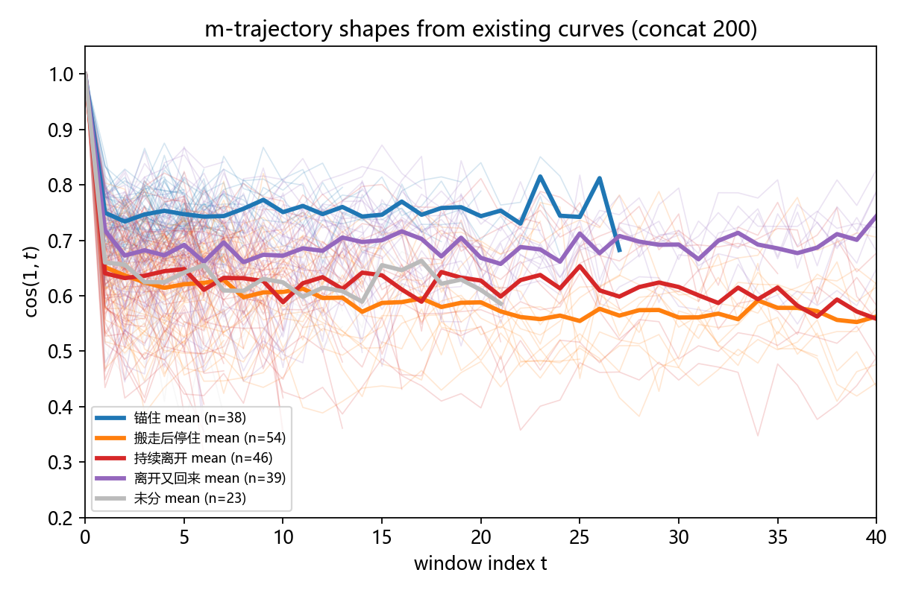
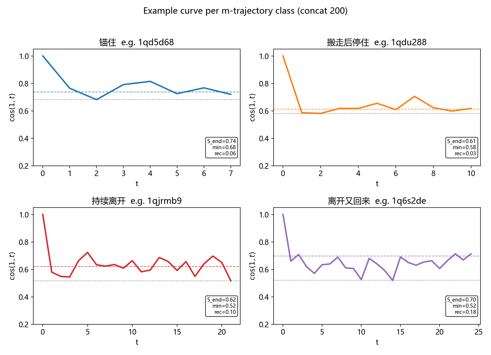
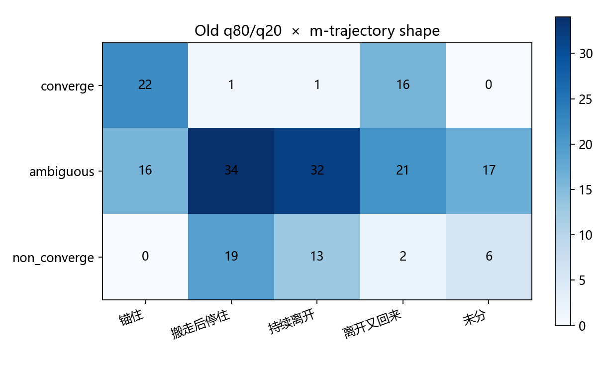
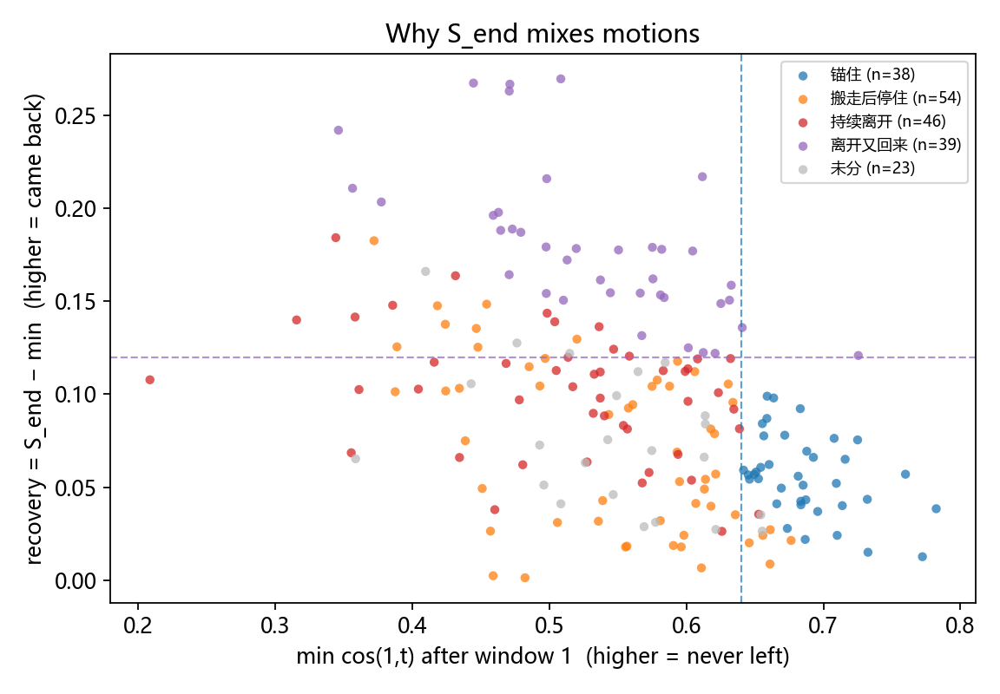
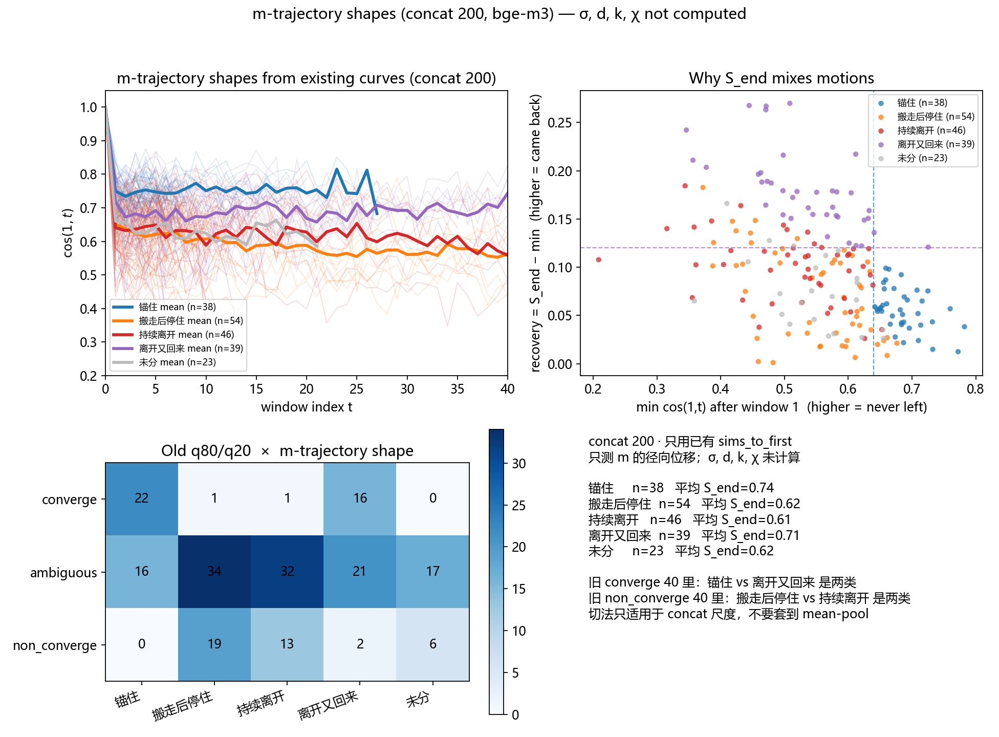

# 讨论云中心 \(m\) 的轨迹形状分类：concat 200 工作笔记

**日期**：2026-08-20  
**样本**：Phase-1 concat 试点，\(n=200\)（`outputs/labels/thread_labels_q80q20.jsonl`）  
**本文性质**：方法备忘与阶段性实证，不是最终分类方案，也不是人机对比结论。  
**观测范围**：本文只使用已存储的 \(\cos(1,t)\) 曲线，即讨论云中心 \(m\) 相对第一窗的径向位移。散布 \(\sigma\)、有效维数 \(d\)、模态数 \(k\) 与换位 \(\chi\) **在本文中未被计算**；它们需要保留评论级向量后重新估计。文中出现这四个符号时，均属于框架定位或限度说明，不是本文的测量结果。

---

## 摘要

Phase-1 用末期相对第一窗的余弦相似度 \(S_{end}\) 在人类帖内部做相对二分（q80/q20）。该标量刻画的是轨迹的终点位置，而不是轨迹本身。若两条帖的终点相近、路径不同，它们会被标成同一类。本文在不重新嵌入的前提下，从已存储的 \(\cos(1,t)\) 序列中提取过程量，将 200 条帖划分为四种互斥的 \(m\)-轨迹形状：锚住、搬走后停住、持续离开、离开又回来。结果表明，旧 converge 组（40 条）中 22 条为锚住、16 条为离开又回来；旧 non_converge 组（40 条）中 19 条为搬走后停住、13 条为持续离开。因此，\(S_{end}\) 两端各自是路径混合物，不宜直接当作单一运动类型进入后续对照实验。本文只观测讨论云中心 \(m\) 相对起点的位移，尚未估计散布 \(\sigma\)、有效维数 \(d\)、模态数 \(k\) 与换位 \(\chi\)。

---

## 1. 问题

### 1.1 终点标量与路径不等价

记第 \(t\) 个评论窗相对第一窗的余弦相似度为 \(s_t = \cos(v_1, v_t)\)，且 \(s_1 = 1\)。

Phase-1 的主分数取末期平均 \(S_{end}\)，即最后 \(k\) 个窗的均值，其中 \(k = \min(3, T)\)，\(T\) 为窗数。

在样本内按 \(S_{end}\) 的第 80 / 20 百分位切开，得到 converge / non_converge / ambiguous。该规则回答的问题是：就**终点相对起点的距离**而言，哪些帖更锚、哪些帖更散。它不回答：到达该终点的**路径**是否同类。

终点到路径是多对一映射。至少存在两组无法被 \(S_{end}\) 区分的路径：

1. **高 \(S_{end}\)** 既可由「全程靠近 \(v_1\)」产生，也可由「一度远离 \(v_1\)、随后返回」产生。前者是中心未迁移；后者在讨论云框架中接近 Orbit。
2. **低 \(S_{end}\)** 既可由「迁移后在新位置稳定」产生，也可由「末期仍在远离」产生。前者接近 Translation 之后的冻结；后者是仍在进行的迁移或扩散。

若后续实验把 converge / non_converge 当作两种同质种子池，上述混合物会被当作处理条件，人机对比的可解释性随之下降。

### 1.2 本文的有限目标

讨论云用五个序参量 \((m,\sigma,d,k,\chi)\) 描述状态，用十条运动描述状态的时间变化。现有 jsonl 只保存了窗向量相对第一窗的相似度，等价于 \(m(t)\) 到 \(m(1)\) 的一维投影。因此本文只做一件事：在该投影上给出可复现的形状分类，并检验它与 q80/q20 的交叉结构。

不在本文范围之内的包括：重新嵌入、mean-pool 650 的重标定、\(\sigma,d,k,\chi\) 的估计，以及多智能体模拟。

---

## 2. 数据与操作化

### 2.1 样本与窗向量

样本为 Phase-1 第一部分的 200 条 Reddit 线程。窗宽为 10 条评论；窗向量由窗内文本拼接后一次嵌入得到（concat）。该构造下 \(S_{end}\) 的样本中位数约为 0.67，收敛类约在 0.73–0.85。同一批帖若改用评论级均值池化，分数会被整体抬高并压窄。**下文阈值仅适用于 concat 尺度，不得移植到 mean-pool 结果。**

### 2.2 从 \(s_t\) 提取的过程量

对长度 \(T\ge 3\) 的序列定义：

| 记号 | 定义 | 所刻画的几何事实 |
|---|---|---|
| \(S_{end}\) | 末期 \(k\) 窗平均，\(k=\min(3,T)\) | 终点相对 \(m(1)\) 的位置 |
| \(\min\) | \(\min_{t\ge 2}s_t\) | 过程中相对 \(m(1)\) 的最远偏离 |
| \(\mathrm{depth}\) | \(1-\min\) | 上述偏离的幅度 |
| \(\mathrm{recovery}\) | \(S_{end}-\min\) | 自最远点返回的幅度 |
| \(\mathrm{late\_slope}\) | 末期 \(k\) 窗对窗序号的线性斜率 | 终点邻域的趋势 |
| \(\mathrm{late\_std}\) | 末期 \(k\) 窗的标准差 | 终点邻域的稳定程度 |

恒等式 \(S_{end} \approx \min + \mathrm{recovery}\) 表明：终点位置是「走了多远」与「回来多少」的和。仅对 \(S_{end}\) 设阈，必然把不同的 \((\min,\mathrm{recovery})\) 组合并入同一类。

### 2.3 互斥分类规则

类别按下列优先级赋予，一经命中即停止。阈值按本样本分布标定，不是外部给定的物理常数。

1. **离开又回来（orbit）**  
   \(\mathrm{recovery}\ge 0.12\) 且 \(\mathrm{recovery}\ge 0.30\cdot\mathrm{depth}\)。  
   含义：相对最大偏离，返回幅度足够大，终点不能代表路径最低点。

2. **锚住（anchored）**  
   \(\min\ge 0.64\) 且 \(S_{end}\ge 0.70\)。  
   含义：过程最低点仍高，终点也高，中心未显著离开 \(m(1)\)。

3. **搬走后停住（translated_plateau）**  
   \(\mathrm{late\_slope}\ge -0.02\) 且 \(\mathrm{late\_std}\le 0.045\)。  
   含义：末期趋势不再下降，且波动有限。

4. **持续离开（keep_falling）**  
   \(\mathrm{late\_slope}< -0.025\)。  
   含义：末期仍在远离 \(m(1)\)。

5. **未分（other）**  
   其余。本样本 23 条。典型情形是末期既不满足平台期的低波动，也不满足持续下降的斜率。

优先级将 orbit 置于 anchored 之前，是为避免「终点高、途中低」被终点规则吞掉。translated_plateau 与 keep_falling 的分野不依赖 \(S_{end}\)，而依赖末期动力学；这正是第 1.1 节第二组混淆所要求的。

需要预先声明两处近似。第一，late_slope 为负既可能来自单调下降，也可能来自末期振荡；keep_falling 因此仍是粗类。第二，平台期在此只指 \(m(t)\) 的尾巴稳定，并不等同于 \(\chi\to 0\) 的结晶。

---

## 3. 结果

### 3.1 各类的描述统计

| 类别 | \(n\) | \(\overline{S_{end}}\) | \(\overline{\min}\) | \(\overline{\mathrm{recovery}}\) | \(\overline{\mathrm{late\_slope}}\) |
|---|---|---|---|---|---|
| 锚住 | 38 | 0.74 | 0.69 | 0.06 | −0.015 |
| 搬走后停住 | 54 | 0.62 | 0.55 | 0.07 | +0.006 |
| 持续离开 | 46 | 0.61 | 0.51 | 0.10 | −0.065 |
| 离开又回来 | 39 | 0.71 | 0.53 | 0.18 | −0.034 |
| 未分 | 23 | 0.62 | 0.54 | 0.07 | +0.021 |

有两对比较构成识别论点。

**锚住与离开又回来。** 二者终点接近（0.74 对 0.71），若只用 \(S_{end}\) 会落入同一高分侧。二者的 \(\min\) 分别为 0.69 与 0.53，recovery 分别为 0.06 与 0.18。高 \(S_{end}\) 因此至少混合了「未迁移」与「迁移后返回」。

**搬走后停住与持续离开。** 二者终点几乎相同（0.62 对 0.61），若只用 \(S_{end}\) 会落入同一低分侧。分野在末期斜率（+0.006 对 −0.065）。低 \(S_{end}\) 因此至少混合了「迁移后稳定」与「仍在远离」。

未分类的平均终点与低分侧接近，但不能并入上述任何一类；它标记的是规则空隙，而不是第五种已解释的运动。

### 3.2 与 q80/q20 的列联

行条件为旧标签，列条件为本文形状。单元格为频数。

| 旧标签 | 锚住 | 搬走后停住 | 持续离开 | 离开又回来 | 未分 | 合计 |
|---|---|---|---|---|---|---|
| converge | 22 | 1 | 1 | 16 | 0 | 40 |
| ambiguous | 16 | 34 | 32 | 21 | 17 | 120 |
| non_converge | 0 | 19 | 13 | 2 | 6 | 40 |

在旧 converge 内，锚住占 \(22/40=0.55\)，离开又回来占 \(16/40=0.40\)。换言之，按终点定义的「相对收敛」中，约四成在路径上经历过可观偏离。在旧 non_converge 内，搬走后停住占 \(19/40=0.48\)，持续离开占 \(13/40=0.33\)；锚住为 0。ambiguous 行在所有列上均有质量，表明 \(S_{end}\) 的中间带不是一种运动，而只是终点不够极端。

该列联是本文的核心经验陈述：q80/q20 保留了终点排序，但把不同的 \(m\)-路径压进了同一处理标签。热力图（图 3）给出同一矩阵的可视化；读图时应注意 ambiguous 的行边际为 120，是两端的三倍，深色格并不自动表示「中间带以某运动为主」。

---

## 4. 图示

各图均由 `scripts/classify_motion_shapes.py` 生成。颜色约定：蓝 = 锚住，橙 = 搬走后停住，红 = 持续离开，紫 = 离开又回来，灰 = 未分。

### 图 1. 类别条件平均轨迹

细线为该类随机子样本（每类至多 50 条），粗线为该类在各 \(t\) 上的逐点平均。纵轴为 \(s_t\)。横轴为窗序号，不是物理时间；短帖在大 \(t\) 处缺失，故平均曲线的右尾由长帖支撑，解释均值时应避免把右尾读成全体时间路径。

平均轨迹与第 2.3 节定义一致：锚住维持高位；离开又回来在中段下探后回升；搬走后停住在约 0.6 附近变平；持续离开的均值更低且仍略降。该图的作用是检验标签是否空转。它不提供因果，也不对个体路径的振荡做分解。

### 图 2. 每类一条代表路径

代表帖按距该类 \((S_{end},\mathrm{recovery})\) 均值的距离选取。彩色虚线为该帖 \(S_{end}\)，灰色点线为 \(\min\)。

锚住例（`1qd5d68`）满足高 min、低 recovery。搬走后停住例（`1qdu288`）在 \(t=1\) 之后立即进入低位平台。离开又回来例（`1q6s2de`）的 \(\min=0.52\)、\(S_{end}=0.70\)，若截去中段会被标为相对收敛。持续离开例（`1qjrmb9`）长度更大、末期振荡更强：它说明 late_slope 规则捕获的是「终点邻域仍不稳定或仍下降」，而不是理想化的单调射线。将该限制读进结论，比再调一轮阈值更重要。

### 图 3. 列联的热力表示

单元格为频数，色深随频数增加。解读对象是第 3.2 节已经给出的比，而不是色阶本身。首行的 22 与 16、末行的 19 与 13 是混合物的直接证据。

### 图 4. \((\min,\mathrm{recovery})\) 平面

横轴为过程最低相似度，纵轴为返回幅度。蓝色虚线为锚住的 min 阈值，紫色虚线为 orbit 的 recovery 阈值。锚住落在右下（未远离，无需返回）；离开又回来落在上方（远离后返回）。搬走后停住与持续离开共同落在左下（远离且少返回）；二者的区分依赖 late_slope，无法在该二维投影上完成。

此图把第 2.2 节的恒等式几何化：对 \(S_{end}\) 设阈，相当于对 \(\min+\mathrm{recovery}\) 设阈，从而把右下与上方并为「高终点」，把左下的两种末期动力学并为「低终点」。

### 图 5. 四联总览

左上、右上、左下分别对应图 1、图 4、图 3；右下为样本量与类条件平均 \(S_{end}\) 的文字摘要。信息与分图相同。

---

## 5. 与五序参量框架的关系

本文分类是五序参量体系在观测不足时的投影，不是该体系的实现。

| 序参量 | 本文是否可识别 | 原因 |
|---|---|---|
| \(m\) | 部分 | \(s_t\) 给出 \(m(t)\) 相对 \(m(1)\) 的径向距离，丢失切向位移与窗内结构 |
| \(\sigma\) | 否 | concat 在嵌入前将窗内评论坍缩为单点 |
| \(d\) | 否 | 有效维数需要评论级向量的协方差结构 |
| \(k\) | 否 | 模态数需要对窗内点做聚类 |
| \(\chi\) | 否 | 换位需要对发言者身份或相邻窗的内部匹配 |

与运动表的对应同样是粗的、单向的：

| 本文类别 | 可兼容的运动 | 不能推出的结论 |
|---|---|---|
| 锚住 | \(m\) 未发生显著 Translation | 不能区分「未迁移但内部仍散」与 Condensation |
| 搬走后停住 | Translation 后 \(m\) 稳定 | 不能把稳定读成 Crystallization（\(\chi\to 0\)） |
| 持续离开 | 仍在进行的 Translation 或 Diffusion | 不能判断 \(\sigma\) 是否上升 |
| 离开又回来 | Orbit 在 \(m\) 径向投影上的表现 | 不能确认是否存在 \(\chi\) 的周期换位 |

讨论云框架中，Translation 本身不构成新意丢失；Condensation、Crystallization 与 Orbit 才被标为 novelty lost。因此，即使把旧 non_converge 改称为「低 \(S_{end}\)」，也仍不能把它等同于语义塌缩。本文的直接推论只到「终点标签是路径混合物」为止。

---

## 6. 限度与对后续设计的含义

**可支持的陈述。** 在 concat 200 上，仅用已存轨迹即可得到四种可解释的 \(m\)-形状；q80/q20 的两端在这些形状上不是单峰的。若仍以 \(S_{end}\) 构造人类种子池，实验报告需要把「相对终点位置」与「运动类型」分开写。

**不能支持的陈述。** 本文不证明哪一类对应新意丢失，不证明多智能体更易进入哪一类，也不证明同一规则在 mean-pool 或全量 1900 上比例不变。阈值未经样本外校准；未分 23 条与 keep_falling 中的振荡帖表明规则仍是启发式的。将启发式在 \(n=200\) 上继续细分，有过拟合风险。

**对下一步的约束。** 若目标是完整运动分类，需要保留评论级向量并估计 \(\sigma,d,k,\chi\)，而不是在 \(s_t\) 上增加更多硬阈值。若当前目标只是确认终点标签的混合物结构，则本文的列联与 \((\min,\mathrm{recovery})\) 平面已经构成可提交的证据。mean-pool 结果若要做平行分析，必须重新标定第 2.3 节的数值，不能沿用 0.64 / 0.70 / 0.12。

---

## 附录：文件

| 内容 | 路径 |
|---|---|
| 本文（Markdown） | `docs/motion_shapes_concat200.md` |
| 本文（HTML） | `docs/motion_shapes_concat200.html` |
| 带形状标签的记录 | `outputs/labels/thread_motions_concat200.jsonl` |
| 规则与汇总 | `outputs/metrics/motion_shapes_concat200_summary.json` |
| 分类与作图 | `scripts/classify_motion_shapes.py` |
| 图 | `docs/figures/motion_shapes_concat200_*.png` |
| 导出 | `python scripts/export_report_html.py --md docs/motion_shapes_concat200.md` |
