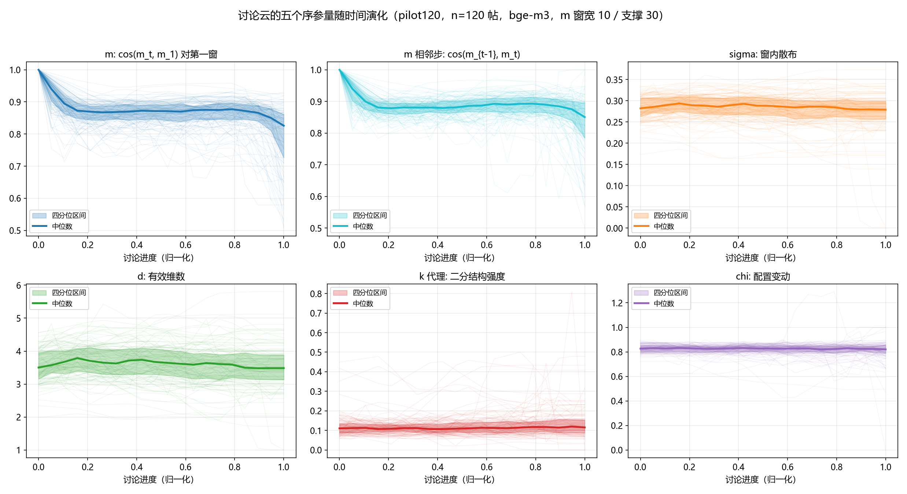
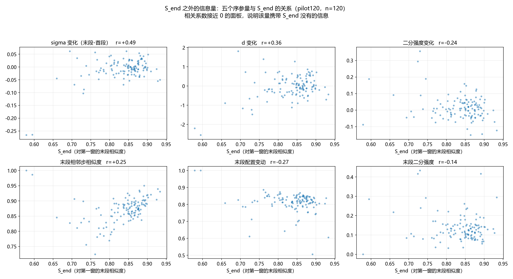
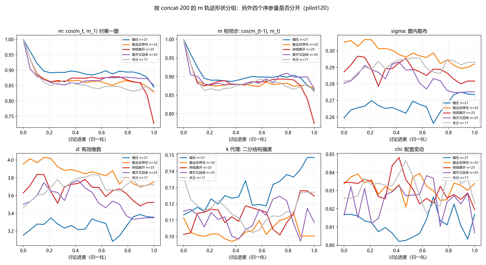

# 讨论云五个序参量：pilot 120 工作笔记

**日期**：2026-08-25  
**样本**：评论级嵌入，\(n=120\)（原计划 200，任务中断后保住的完整断点）  
**嵌入**：`bge-m3`，逐条评论嵌入后按窗聚合  
**时间网格**：\(m\) 用非重叠 10 条评论窗；\(\sigma,d,k\) 用居中 30 条支撑窗、步长 10  
**\(\chi\)**：不看作者身份（相邻窗作者中位重叠 12.5%）  
**本文性质**：方法落地后的第一次完整读数。不是最终分类方案，也不是人机对比结论。整数 \(k\) 几乎恒为 1，Fission 信号改报连续的二分结构强度。

---

## 摘要

在保留每条评论向量的前提下，同一批窗可以同时给出五个序参量：云心 \(m\)、散布 \(\sigma\)、有效维数 \(d\)、模态（整数 \(k\) 加连续二分强度）、换位 \(\chi\)。对 120 条帖的读数是：云心相对第一窗很快落到约 0.85 后走平，相邻步相似度也高（中位约 0.88）；云内部的配置却一直在换（\(\chi\) 中位约 0.82）。整数 \(k\) 在 1781 个窗里有 98.7% 为 1，但二分强度与 \(S_{end}\) 几乎不相关（\(r=-0.14\)），\(\sigma\) 变化与 \(S_{end}\) 也只有中等相关（\(r=+0.49\)）。按 concat-200 的 \(m\) 形状分组后，\(\sigma\) 和 \(d\) 能把「锚住」和「搬走后停住」分开，而 \(\chi\) 几乎分不开。因此五个量不是 \(S_{end}\) 的重复测量，但本批样本偏小、\(S_{end}\) 分布被压在 0.81–0.88，结论暂不作阈值。

---

## 1. 样本与口径

任务原计划跑 200 条。进程在约 53 条时被外部中断，但检查点每 20 条落一次，最终保住 **120 条**。这 120 条的 `post_id` 全部落在 concat-200 集合内，所以可以按已有的 \(m\) 轨迹形状做对照，但不能把对照读成「同一套嵌入」。concat 形状来自拼接窗口向量，本笔记的五个量来自评论级向量。

| 项 | 取值 |
|---|---|
| 帖数 | 120 |
| 窗数 | 1781 |
| \(S_{end}\) 中位 / IQR | 0.852 / 0.812–0.876 |
| 整数 \(k=1\) 的窗占比 | 98.7%（最大为 3） |

续跑不必重头来：`--skip 120 --limit 80` 即可接到 200。

---

## 2. 五个量随时间怎么走



图 1 把每条帖的轨迹归一化到 \([0,1]\) 进度轴，细线是单帖，粗线是中位数，色带是四分位。

**\(m\)（对第一窗）**。离开第一窗发生在前 20% 的讨论进度里，之后中位数停在约 0.85。这与 concat 试点里大量「先掉再走平」的形状一致，只是 mean-pool 把终点压得更靠近 1。

**\(m\) 相邻步**。中位数约 0.88，全程走平。云心每一步只挪一点。老师在 concat 会上看到的「对第一窗可以到 0.9、相邻步却很低」，在**评论级 mean-pool** 上没有复现：这里相邻步也高。相邻步真正掉下去的，几乎只出现在 concat 形状里被标成「持续离开」的那一组（见图 3 红线末段）。

**\(\sigma\)**。中位约 0.28，全程几乎不变。讨论云的半径没有系统性膨胀或收缩。

**\(d\)**。中位约 3.5（30 个点的支撑上），同样走平。有效方向数既没有塌到 1，也没有张开到接近窗宽。

**二分强度（\(k\) 的连续代理）**。中位约 0.12，很低。个别帖末段会冲到 0.4 以上，但整体上 30 条连续评论很少裂成两坨。整数 \(k\) 饱和在 1，是预料之中的；连续量至少还能看到尾部的少量抬升。

**\(\chi\)（配置变动）**。中位约 0.82，窄带走平。去掉云心平移之后，相邻两窗的内部点几乎对不上。结合「相邻步 \(m\) 很高」，这是本批最清楚的一句描述：**中心慢、成员换得快**。Reddit 窗之间作者重叠本来就低，这个身份无关的 \(\chi\) 把同一现象写进了向量几何。

---

## 3. 它们是不是 \(S_{end}\) 的重复测量



| 量 | 与 \(S_{end}\) 的 \(r\) | 读法 |
|---|---|---|
| \(\sigma\) 变化（末−首） | \(+0.49\) | 中等；终点更锚的帖，半径往往也没扩 |
| \(d\) 变化 | \(+0.36\) | 弱到中等 |
| 末段相邻步 | \(+0.25\) | 弱 |
| 二分强度变化 | \(-0.24\) | 弱 |
| 末段 \(\chi\) | \(-0.27\) | 弱 |
| 末段二分强度 | \(-0.14\) | 接近独立 |

两枚 \(S_{end}\approx 0.58\) 的离群点在拉高若干相关系数；去掉它们之后，主簇仍挤在 \(S_{end}\in[0.75,0.95]\)。mean-pool 下的 \(S_{end}\) 区分度比 concat 窄，以后若再切 q80/q20，阈值会和 concat-200 对不齐——这是已知限制，不是本笔记的新发现。

---

## 4. 用 concat 的 \(m\) 形状看另外四个量

这 120 条全部带有 concat-200 的形状标签。图 3 画的是每组的中位轨迹。形状标签来自另一套窗口构造，只作探索性对照。



| concat 形状 | \(n\) | \(S_{end}\) | \(\sigma\) 变化 | \(d\) 变化 | 末段二分 | 末段 \(\chi\) | 末段相邻步 |
|---|---|---|---|---|---|---|---|
| 锚住 | 21 | 0.877 | \(+0.006\) | \(+0.12\) | 0.144 | 0.805 | 0.883 |
| 搬走后停住 | 32 | 0.820 | \(-0.025\) | \(-0.25\) | 0.134 | 0.819 | 0.878 |
| 持续离开 | 25 | 0.814 | \(-0.008\) | \(-0.07\) | 0.137 | 0.807 | 0.848 |
| 离开又回来 | 25 | 0.853 | \(-0.006\) | \(-0.07\) | 0.129 | 0.821 | 0.879 |
| 未分 | 17 | 0.829 | \(+0.004\) | \(+0.22\) | 0.131 | 0.806 | 0.861 |

三件读得出来的事：

1. **\(\sigma\) 和 \(d\) 能分开「锚住」和「搬走后停住」**。锚住组半径更小、有效维数更低；搬走后停住组反过来。单看 \(S_{end}\) 两者只差 0.06，云的内部结构差得更清楚。
2. **「持续离开」是唯一在相邻步上掉下去的组**。它的末段 \(\cos(m_{t-1},m_t)\) 中位 0.85，其余组在 0.88 附近。老师要的「相邻步才看得见的运动」，至少在这一组上对得上。
3. **\(\chi\) 几乎不分组**。五条中位线叠在 0.80–0.85。配置变动像是 Reddit 评论窗的背景噪声，不是形状分类器在用的那根轴。

---

## 5. 现在能下的判断，和还不能下的判断

能下：

- 五个量已经能从同一批评论向量里算出来，嵌入成本与 mean-pool 标注相同。
- \(S_{end}\) 没有吃掉 \(\sigma,d,k,\chi\)。最独立的是二分强度，最有分组能力的是 \(\sigma\) 和 \(d\)。
- 评论级 mean-pool 上，典型人类帖更像「中心慢移、内部快换」，而不是「一团点一起漂走」。
- 整数 \(k\) 在 30 条支撑上不可用；连续二分强度可用，但本批整体偏低。

还不能下：

- 十条运动的判别规则。现在只有 \(m\) 的形状分类，加上另外四个量的描述统计，没有联合分类器。
- Fission 是否真实存在。二分强度中位 0.12，可能是 Reddit 短评本身切不干净，也可能是 30 条支撑不够。
- 人机对比。多智能体侧还没有用同一套五个量打分。
- 把 120 条的相关系数当成总体。样本是按文件顺序取的前 120 条合格帖，不是随机子样。

---

## 6. 文件

| 路径 | 内容 |
|---|---|
| `outputs/order_params/order_params_pilot120.jsonl` | 120 条的完整轨迹 |
| `outputs/metrics/order_params_pilot120_stats.json` | 描述统计与相关系数 |
| `outputs/figures/order_params_traj_pilot120.png` | 图 1 |
| `outputs/figures/order_params_vs_send_pilot120.png` | 图 2 |
| `outputs/figures/order_params_by_motion_pilot120.png` | 图 3 |

续跑到 200：

```bash
python scripts/extract_order_params.py --skip 120 --limit 80 --tag pilot200_rest
```
