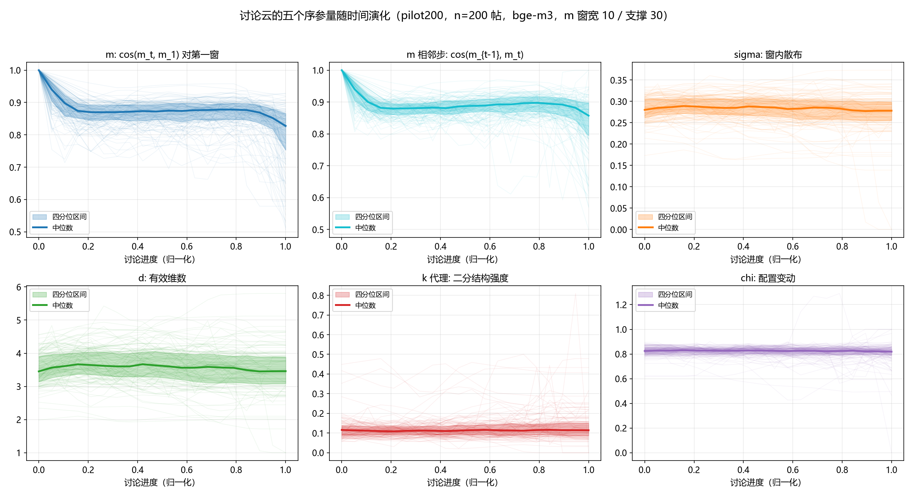
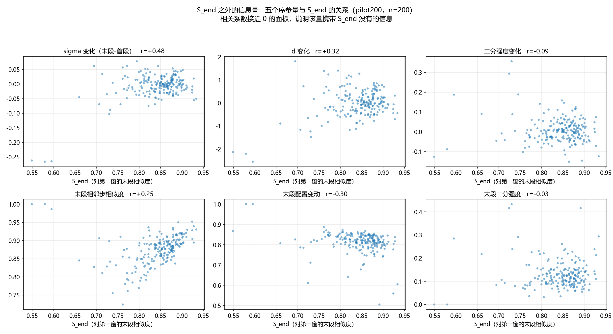
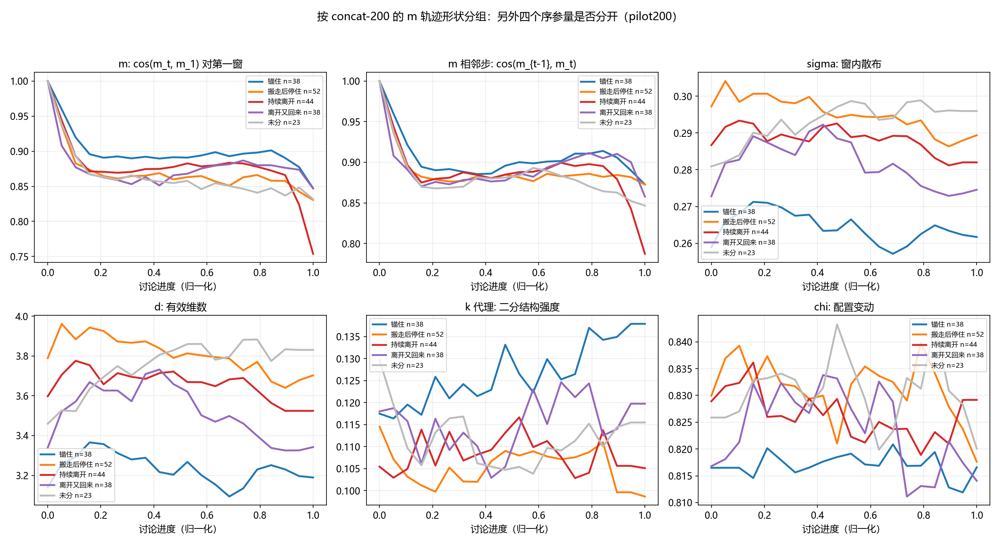

# 讨论云五个序参量的估计与初步读数：评论级嵌入，\(n=200\)

**日期**：2026-08-26  
**样本**：Phase-1 合格线程的前 200 条；评论级 `bge-m3` 嵌入  
**本文性质**：方法落地后的第一次满样本读数。不是十条运动的最终分类方案，也不是人机对比结论。  
**观测范围**：本文同时估计讨论云的五个序参量 \((m,\sigma,d,k,\chi)\)。整数模态数 \(k\) 在本支撑尺度上几乎恒为 1，Fission 相关的报告改用连续的二分结构强度。与 concat-200 的 \(m\)-轨迹形状对照是跨窗口构造的探索性分析，不得读成同一套嵌入上的交叉表。

---

## 摘要

Phase-1 用末期相对第一窗的余弦相似度 \(S_{end}\) 刻画语义收敛。该标量是讨论云中心 \(m\) 的一维径向投影，不能单独回答云是否散开、是否降维、是否裂成阵营、内部配置是否更换。本文在逐条评论嵌入的前提下保留点云，使五个序参量从同一批向量中同时估计：\(m\) 取非重叠 10 条评论窗的归一化均值；\(\sigma\)、\(d\)、\(k\) 取与之对齐、宽度为 30 的支撑窗；\(\chi\) 取身份无关的相邻步变化，因为相邻窗的作者中位重叠仅 12.5%。对 \(n=200\)（3037 窗）的读数表明：中心相对第一窗在前 20% 进度内降至约 0.85 后走平，相邻步相似度中位为 0.88；去掉平移后的配置匹配代价中位为 0.82。整数 \(k\) 在 99.2% 的窗上为 1。末段二分强度与 \(S_{end}\) 的相关系数为 \(-0.03\)，\(\sigma\) 的首末变化与 \(S_{end}\) 的相关系数为 \(+0.48\)。按 concat-200 的 \(m\) 形状分组（195/200 对齐）后，\(\sigma\) 与 \(d\) 可将「锚住」与「搬走后停住」分开，「持续离开」是唯一在末段相邻步上下降的组，\(\chi\) 几乎不分组。因此，五个量不是 \(S_{end}\) 的重复测量；在评论级均值池化下，典型人类讨论更接近「中心慢移、内部快换」。

---

## 1. 问题

### 1.1 单标量不能还原云的状态

既有标注把末期相对第一窗的均值 \(S_{end}=\overline{\cos(m_1,m_t)}\)（对末期窗取平均）当作主分数，并在样本内按分位数切开。该分数回答的是：末期中心相对起点有多近。它不回答下列互不蕴含的问题：

1. 窗内各条评论离中心有多远（散布 \(\sigma\)）；
2. 点云占据了多少有效方向（维数 \(d\)）；
3. 点云是一团还是若干分离的模态（模态 \(k\)）；
4. 相邻两窗之间，点的相对位置是否更换（换位 \(\chi\)）。

\(\sigma\) 上升既可以来自均匀扩散，也可以来自裂成两派；二者只有 \(k\) 能够区分。相邻步 \(\cos(m_{t-1},m_t)\) 很高，只说明中心几乎未动，不说明窗内成员仍占据原位。若后续实验把 \(S_{end}\) 的两端当作两种同质过程，上述混合物会被当作处理条件。

### 1.2 本文的目标与限度

本文只做三件事：给出五个量的可复现定义；在 \(n=200\) 上报告其时间演化及与 \(S_{end}\) 的相关结构；检验它们是否能把既有的 concat \(m\)-形状进一步分开。

不在本文范围之内的包括：十条运动的联合判别器、多智能体侧的对照、将本批相关系数当作总体估计，以及把 mean-pool 下的 \(S_{end}\) 分位数阈值移植到 concat 尺度。

---

## 2. 操作化

### 2.1 样本与嵌入

样本为按配置过滤后的 Reddit 线程（评论数 \(\ge 50\) 且 \(\le 1000\)）中文件顺序的前 200 条，不是随机子样。每条评论单独嵌入（`BAAI/bge-m3`），得到 L2 归一化向量。嵌入成本与既有 mean-pool 标注相同：每条评论只编码一次。评论向量本身不落盘；写入的是按窗聚合后的标量轨迹。

数据分两段完成：先得到 120 条完整断点，再以 `--skip 120 --limit 80` 续跑。两段 `post_id` 无交集，合并后为 200 条。

### 2.2 时间网格与估计支撑的分离

\(m\) 只需窗心，10 条评论足以与既有 `sims_to_first` 曲线对齐，并保留小窗的时间分辨率。\(\sigma\)、\(d\)、\(k\) 描述的是窗内点云，10 个点不足以稳定估计有效维数或模态。因此二者拆开：

| 量 | 窗构造 | 理由 |
|---|---|---|
| \(m\) | 非重叠，宽度 10 | 与既有径向曲线可比 |
| \(\sigma,d,k\) | 宽度 30、步长 10，与 \(m\) 的块对齐 | 每个时间点约 30 个点支撑估计 |
| \(\chi\) | 相邻两个宽度为 10 的块 | 身份无关的相邻步比较 |

输出仍落在同一条时间轴上。帖级汇总取末期 \(k=\min(3,T)\) 窗的均值，与既有 \(S_{end}\) 的末期定义一致。

### 2.3 五个量的定义

设窗内评论向量为 \(\{x_i\}_{i=1}^{n}\)，已 L2 归一化。

| 记号 | 名称 | 定义 |
|---|---|---|
| \(m\) | 云心 | \(m=\mathrm{normalize}(\frac{1}{n}\sum_i x_i)\)。报告 \(\cos(m_1,m_t)\) 与相邻步 \(\cos(m_{t-1},m_t)\) |
| \(\sigma\) | 散布 | 各点到 \(m\) 的平均余弦距离：\(\sigma=\frac{1}{n}\sum_i(1-\cos(x_i,m))\) |
| \(d\) | 有效维数 | 余弦核 \(K_{ij}=\cos(x_i,x_j)\) 特征值的参与比 \((\sum\lambda)^2/\sum\lambda^2\) |
| \(k\) | 模态 | 自调谐亲和度（Zelnik–Manor 局部尺度）上归一化拉普拉斯的特征间隙；并报告 Fiedler 二分的余弦 silhouette 作为连续代理 |
| \(\chi\) | 换位 | 身份无关。中心步：\(1-\cos(m_{t-1},m_t)\)；配置步：两窗去中心并归一化后，匈牙利算法匹配的平均余弦距离 |

连续二分强度接近 0 表示点云接近单团，切成两坨没有几何依据；升高表示出现可分离的两团。同时报告较小团的占比（`mode_balance`），以避免把 1 对 29 的切分读成阵营分裂。

### 2.4 \(\chi\) 不使用作者身份的原因

讨论云框架中的换位以「同一批成员更换相对位置」为前提。在 200 条帖、2990 个宽度为 10 的窗上实测：窗内作者唯一比例均值为 0.78，但相邻窗作者重叠的中位数仅为 0.125，且 37.7% 的相邻窗对完全不重叠。按作者追踪会丢掉大量窗，并使剩余样本偏向少数重复发言者。因此主口径采用身份无关的相邻步；作者级 \(\chi\) 留作后续稳健性检验，本文不计算。

### 2.5 整数 \(k\) 的预期失效

宽度 30 的连续评论在短文本嵌入下通常构成连通图。连通图的特征间隙倾向于给出 \(k=1\)。本文仍保存整数 \(k\) 作为参考，但不把它当作 Fission 的可操作信号。

---

## 3. 结果

### 3.1 时间演化

| 量 | 样本中位（帖级） | 图 1 上的过程形态 |
|---|---|---|
| \(\cos(m_1,m_t)\) 的末期，即 \(S_{end}\) | 0.855（IQR 0.820–0.879） | 前 20% 进度下降，随后走平，尾部略降 |
| 相邻步 \(\cos(m_{t-1},m_t)\) | 全程中位约 0.88；末期 0.880 | 离开第一窗之后几乎走平 |
| \(\sigma\) | 首段 0.280，末段 0.278 | 半径无系统性膨胀或收缩 |
| \(d\) | 首段 3.45，末段 3.47 | 有效方向数稳定在约 3.5（30 点支撑） |
| 二分强度 | 首段 0.116，末段 0.117 | 整体偏低；个别帖末段抬升 |
| 配置 \(\chi\) | 全程中位 0.825；末期 0.820 | 窄带走平 |
| 整数 \(k=1\) 的窗占比 | 3037 窗中 99.2%（最大为 3） | 整数估计饱和 |

先前在拼接窗口上观察到的现象——相对第一窗可高达 0.9、相邻步却很低——在评论级均值池化上**没有整体复现**。此处相邻步同样高。相邻步的显著下降集中在 concat 形状被标为「持续离开」的子集（见 3.3）。

结合「相邻步高」与「配置 \(\chi\) 高」，本样本最稳定的描述是：云心每一步只作小位移，去掉该位移后，相邻两窗的内部点几乎无法匹配。即中心慢移、成员更换快。这与相邻窗作者重叠低的事实一致，但 \(\chi\) 并不依赖身份标签。

### 3.2 五个量是否被 \(S_{end}\) 吸收

若某量只是 \(S_{end}\) 的单调变换，它与 \(S_{end}\) 的相关系数应接近 \(\pm 1\)。图 2 给出帖级汇总与 \(S_{end}\) 的散点。

| 量 | \(n=120\) | \(n=200\) | 读法 |
|---|---|---|---|
| \(\sigma\) 变化（末段 \(-\) 首段） | \(+0.49\) | \(+0.48\) | 中等；终点更锚的帖，半径往往也未扩张 |
| \(d\) 变化 | \(+0.36\) | \(+0.32\) | 弱到中等 |
| 末段相邻步 | \(+0.25\) | \(+0.25\) | 弱 |
| 末段配置 \(\chi\) | \(-0.27\) | \(-0.30\) | 弱负相关 |
| 二分强度变化 | \(-0.24\) | \(-0.09\) | 加样本后更接近独立 |
| 末段二分强度 | \(-0.14\) | \(-0.03\) | 接近正交 |

加样本并未推翻 120 条断点上的结构，只使二分强度的独立性更清楚。\(S_{end}\) 的主体落在 \([0.82,0.88]\)，区分度窄于 concat-200（后者中位约 0.67）。因此，mean-pool 下不宜沿用 concat 的 q80/q20 阈值。左下角少数 \(S_{end}\approx 0.58\) 的点会拉动若干相关系数，主簇内部的相关更弱。

### 3.3 与 concat \(m\)-形状的交叉

concat-200 已按 \(\cos(m_1,m_t)\) 曲线将线程分为锚住、搬走后停住、持续离开、离开又回来及残余类。该标签来自拼接窗口向量。本批 200 条中有 195 条 `post_id` 与之对齐。图 3 给出各组在评论级五个量上的中位轨迹。跨构造对照只用于检验：仅看 \(m\) 的径向形状时被分开的帖，其 \(\sigma,d,k,\chi\) 是否也分开。

| concat 形状 | \(n\) | \(S_{end}\) | \(\sigma\) 变化 | \(d\) 变化 | 末段二分 | 末段 \(\chi\) | 末段相邻步 |
|---|---|---|---|---|---|---|---|
| 锚住 | 38 | 0.879 | \(+0.002\) | \(+0.07\) | 0.138 | 0.810 | 0.891 |
| 搬走后停住 | 52 | 0.825 | \(-0.023\) | \(-0.20\) | 0.123 | 0.817 | 0.883 |
| 持续离开 | 44 | 0.828 | \(-0.003\) | \(+0.03\) | 0.127 | 0.813 | 0.853 |
| 离开又回来 | 38 | 0.854 | \(-0.003\) | \(-0.02\) | 0.133 | 0.814 | 0.883 |
| 未分 | 23 | 0.831 | \(+0.011\) | \(+0.33\) | 0.128 | 0.812 | 0.856 |

可分离的结构有三条。

1. **\(\sigma\) 与 \(d\) 区分「锚住」与「搬走后停住」。** 二者 \(S_{end}\) 仅差约 0.05，但锚住组半径更小、有效维数更低；搬走后停住组相反。终点接近并不蕴含内部几何接近。
2. **「持续离开」是唯一在末段相邻步上明显下降的组**（0.853，其余组约 0.88）。相对第一窗的持续下降，在评论级均值上对应相邻步的加速，而不是单纯的终点偏低。
3. **配置 \(\chi\) 不分组。** 五组中位线叠在 0.81–0.82。该量更像评论窗更替的背景，而不是 \(m\)-形状分类所依赖的轴。

锚住组的二分强度在后半段相对抬升。这与「中心未迁走、内部出现可切分结构」相容，但绝对值仍低（约 0.14），不足以下 Fission 的存在性结论。

---

## 4. 解释与限度

### 4.1 可成立的陈述

在评论级均值池化、窗宽 10 / 支撑 30、身份无关 \(\chi\) 的口径下：

1. 五个序参量可从同一批评论向量中算出，不增加嵌入成本。
2. \(S_{end}\) 没有吸收 \(\sigma,d,k,\chi\)。与 \(S_{end}\) 最接近正交的是二分强度；对 concat \(m\)-形状最有区分力的是 \(\sigma\) 与 \(d\)。
3. 典型轨迹不是「一团点整体漂走」，而是中心慢、配置换得快。
4. 整数 \(k\) 在本支撑上不可作为 Fission 的计数器。

### 4.2 尚不成立的陈述

1. 十条运动尚未被五个量的联合轨迹唯一标定。本文只有 \(m\) 的既有形状标签，加上另外四个量的描述统计。
2. 不能根据中位二分强度 0.12 断定人类讨论不存在阵营分裂：30 条时间连续的短评论可能本来就切不干净，支撑也可能不足。
3. 不能把 200 条的相关系数外推到全部合格帖：样本是文件顺序的前 200 条。
4. 不能把图 3 读成「同一嵌入下的形状 \(\times\) 序参量」交叉表。形状来自 concat，序参量来自评论级均值。

### 4.3 对后续实验的直接推论

若人机对照仍以 \(S_{end}\) 的 q80/q20 为处理条件，则处理组在路径与内部几何上仍是混合物。更干净的做法是：在评论级五个量上先描述人类侧的典型运动，再对多智能体输出施加同一套估计，而不是先按单一径向分数分层。

---

## 5. 文件

| 路径 | 内容 |
|---|---|
| `outputs/order_params/order_params_pilot200.jsonl` | 200 条完整轨迹 |
| `outputs/metrics/order_params_pilot200_stats.json` | 描述统计、相关系数、按形状分组的均值 |
| `outputs/figures/order_params_traj_pilot200.png` | 图 1 |
| `outputs/figures/order_params_vs_send_pilot200.png` | 图 2 |
| `outputs/figures/order_params_by_motion_pilot200.png` | 图 3 |
| `scripts/extract_order_params.py` | 提取脚本；`--skip` / `--limit` / `--device` 可分块续跑 |
| `scripts/plot_order_params.py` | 作图与汇总 |
