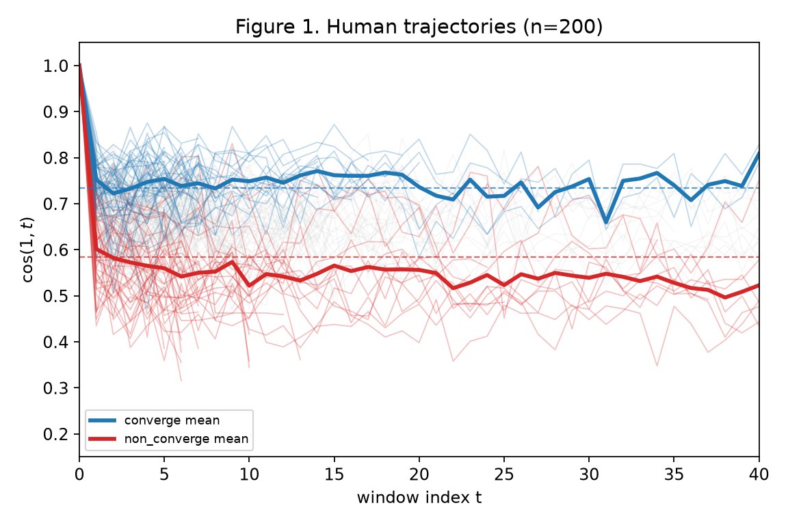
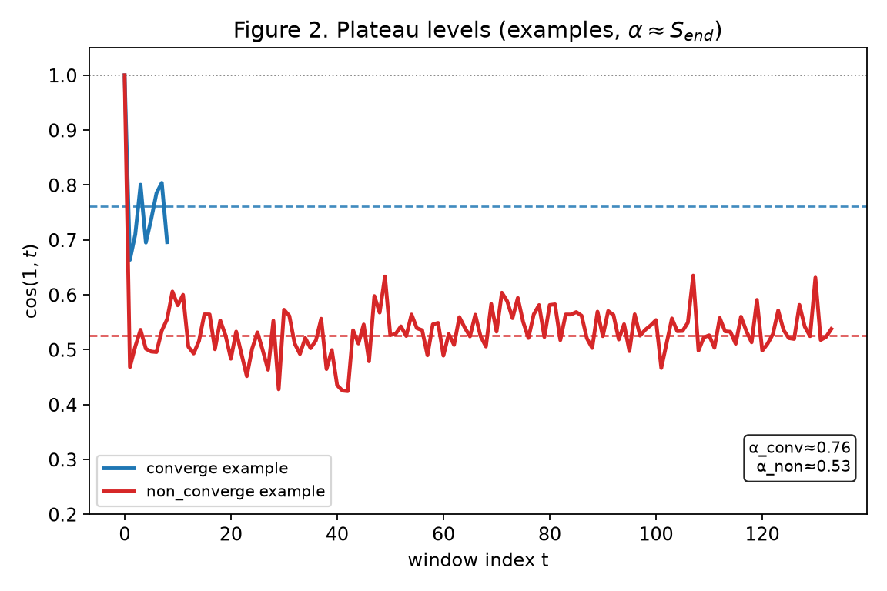
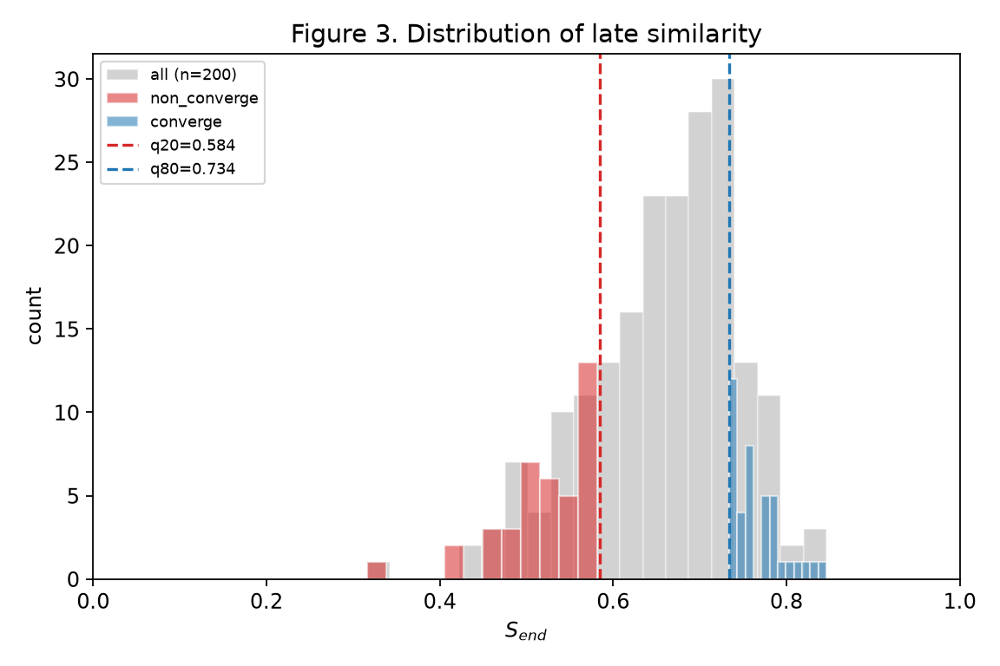
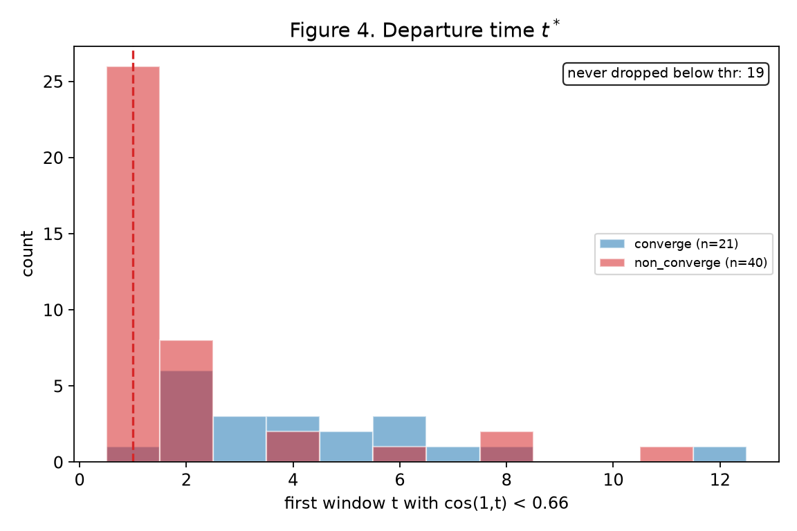
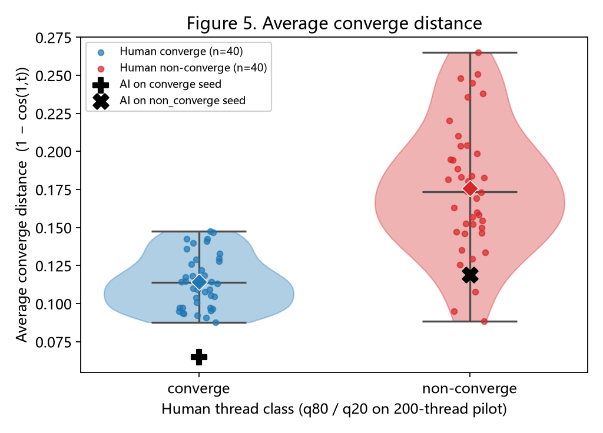
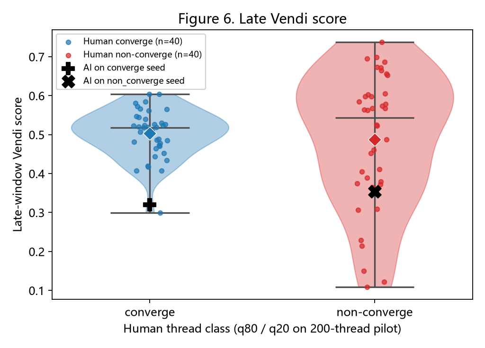
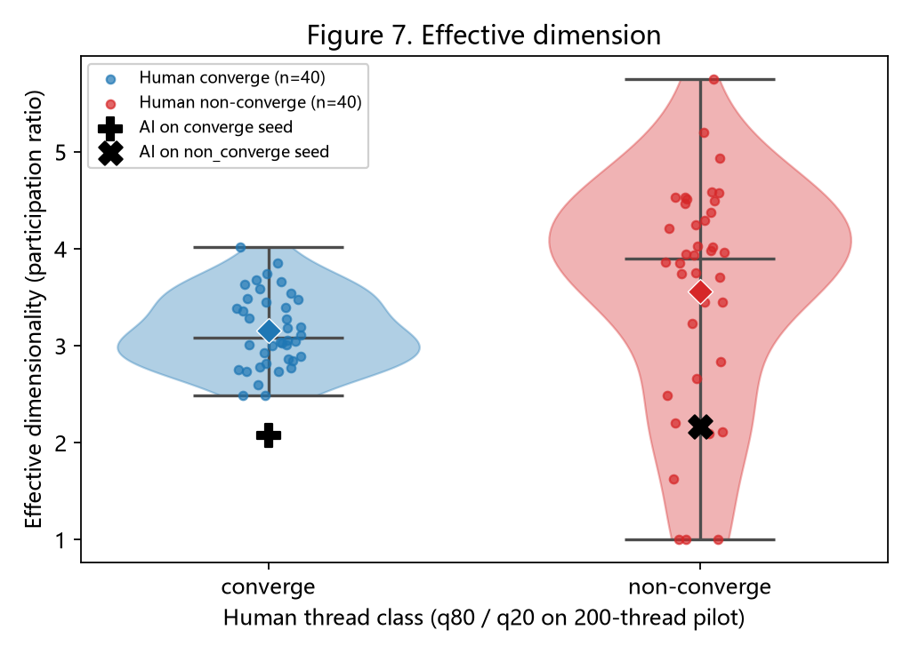
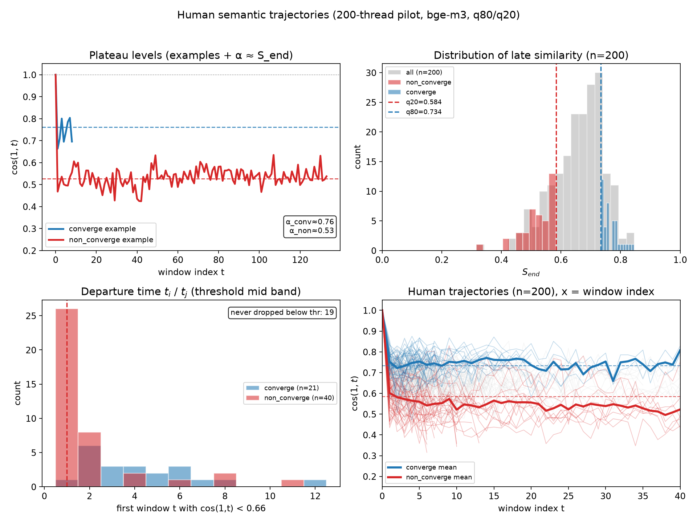

# 多智能体语义收敛研究：Phase-1 前置研究报告

**读者**：尚未接触本项目的同学 / 合作者 / 导师  
**目的**：用尽量少的背景知识，说明我们在研究什么、怎么做、目前得到了什么、接下来做什么  
**项目目录**：`D:\自学\iclr\mas-semantic-collapse`  
**报告日期**：2026-08-08（方法与结果解读已加厚修订）

> **发给别人请打开同目录的** `phase1_status_report.html`（图已嵌进文件，浏览器双击即可）。本 md 是可编辑源文件；改完后运行 `python scripts/export_report_html.py` 再导出 HTML。

---

## 一、一句话概括

我们在研究：当多个大语言模型像 Reddit 评论区那样互相接着聊时，讨论内容会不会越来越“说来说去还是同一套意思”（语义收敛）；以及这种收敛，和真人评论区相比，是不是更容易、更快出现。

当前阶段（Phase-1）只做两件事的准备工作：

1. 先把真人 Reddit 帖子分成“比较容易收敛”和“比较不容易收敛”两类；  
2. 搭好用多个 LLM 模拟评论区的实验框架，方便之后和真人对比。

---

## 二、为什么要做这个研究

### 2.1 现象直觉

在真人社交平台上，有的帖子越聊越围绕原问题打转，有的帖子很快跑题、岔开、变成各说各话。  
多智能体系统（多个 LLM 轮流发言）里，也有类似现象：表面上用词还在变，但意思可能越来越窄、越来越像开场那几句话。

如果多智能体真的更容易“语义收窄”，会直接影响：

- 用多智能体做头脑风暴、科研讨论、内容共创是否靠谱；  
- 是否需要外部信息（例如上网搜索）才能保持讨论的开放性。

### 2.2 和一篇关键参考论文的关系

我们参考了：

> Kong et al., *Multi-LLM Systems Exhibit Robust Semantic Collapse*  
> arXiv:2605.17193

这篇论文的主要发现是：多个 LLM 在**闭环**（不引入外部新信息）里长时间互相对话时，会出现稳健的“语义塌缩”——后期内容在意思上仍靠近起点，即使用词看起来还很多样。他们还发现：多种常见干预（换温度、换提示词、换角色等）很难真正拉开这种语义收窄。论文里也用 Reddit 人类讨论作对照，发现人类更容易离开起点语义。

我们的研究站在同一条问题线上，但现阶段目标不同：

| | 参考论文 | 我们（当前） |
|---|---|---|
| 主要在证明什么 | 闭环 multi-LLM 会语义塌缩，且很难靠内部手段救回来 | 先建立可复现的人类分流 + 多智能体模拟基线，再对比“谁更快/更深收敛” |
| 人类数据怎么用 | 当作连续参考尺度（不把帖子打成两类） | 主动把帖子分成 converge / non_converge，便于对照实验 |
| 下一步关心什么 | 机制与理论限制 | 后续再研究检索/工具调用等开环手段能否减轻收敛 |

---

## 三、方法详解：我们到底怎么判断“收敛”

> 读完本节，应能回答：输入是什么、中间算了什么、输出标签是什么、标签**不能**被理解成什么。

### 3.1 先澄清：我们量的不是“大家意见一致”

| 容易误解成 | 我们实际在量 |
|---|---|
| 评论区里有没有达成共识 / 投票一致 | **后半段讨论的意思，还像不像开头那一阵** |
| 有没有人说“我同意” | 整段文本在 embedding 空间里离起点有多近 |
| 话题标签有没有重复 | 连续语义轨迹，而不是关键词点名 |

一句话：

> **converge = 语义上仍锚在开场附近**  
> **non_converge = 语义上已经明显离开开场**

这和参考论文的 “相对第一窗的语义相似度 / semantic collapse” 是同一类量；我们只是用 converge / non_converge 称呼人类帖子的两端。

### 3.2 全流程总览

```text
一条 Reddit 帖子
    │
    ▼
① 清洗评论（去掉 deleted/removed 等）
    │
    ▼
② 线性化：主楼优先 → 其下回复按时间展开
    │
    ▼
③ 切窗：每 10 条评论 = 1 个“时间窗”
    │
    ▼
④ 每个窗用 embedding 变成一个向量
    │
    ▼
⑤ 算每个窗 vs「第 1 窗」的余弦相似度 → 得到一条曲线
    │
    ▼
⑥ 取曲线末尾 2～3 个点的平均 = S_end（主分数）
    │
    ▼
⑦ 在一批帖子的 S_end 分布上切分位：
      最高 20% → converge
      最低 20% → non_converge
      中间 60% → ambiguous（实验暂不用）
```

### 3.3 每一步在干什么（配“小例子”）

假设某帖线性化后有 30 条有效评论。

**①② 线性化为什么必要**  
Reddit 评论是树：有人回帖，有人回某条评论。若直接按“页面显示”或乱序拼接，时间与语义都会乱。  
我们的规则是：

- 先按时间列出所有**直接回复帖子**的主楼评论；  
- 每条主楼下面，再按时间递归挂上回复。  

这样得到一条从“早到晚、先主干后支线”的评论序列，后面才能谈“前半段 / 后半段”。

**③ 切窗**  
30 条评论 → 3 个窗：

| 窗编号 | 包含评论 | 可理解为 |
|---|---|---|
| 窗 1（起点） | 第 1–10 条 | 讨论刚热起来时在说什么 |
| 窗 2 | 第 11–20 条 | 中段 |
| 窗 3 | 第 21–30 条 | 后段 |

每个窗把 10 条评论的正文拼成一段较长文本。

**④ embedding 是什么（给非技术读者）**  
可以把一段话变成一串数字（向量），让计算机用“距离/夹角”比较两段话意思是否接近。  
我们现阶段用开源模型 `bge-m3`；以后为了和参考论文对齐，会再用 OpenAI `text-embedding-3-large` 复算。

**⑤ 相似度曲线怎么读**  
对每个窗 \(w\)，算它和**窗 1**的余弦相似度，记为 \(\mathrm{sim}(w,1)\)：

- 数值越接近 **1**：和开头越像  
- 数值越低：和开头差得越远  

于是每个帖子都有一条曲线，例如：

```text
窗序号:     1      2      3      4      5      ...
相似度:   1.00   0.73   0.77   0.83   0.84   ...   ← 后期仍高：偏 converge
相似度:   1.00   0.63   0.42   0.38   0.21   ...   ← 后期明显掉：偏 non_converge
```

注意：窗 1 对自己永远是 1.00，这是定义使然，不包含信息；有信息的是**后面各窗相对窗 1 掉了多少**。

**⑥ 主分数 `S_end`**  
只看曲线**尾巴**：最后 2～3 个窗的平均相似度。

- 为什么看尾巴：我们关心的是“聊到后面还像不像开头”，不是开头两窗抖了一下。  
- 为什么不用整条曲线平均：中间波动会被抹平，尾巴上的“最终落点”才更对应“收敛结局”。

**⑦ 如何变成两类标签**  
见下一节；这里先记住：`S_end` 是连续分，标签是在一批帖子里相对切出来的。

### 3.4 为什么锚点选“第一窗”，不选“原帖标题”

可以有两种锚法：

| 锚点 | 问的问题 | 我们为何暂不主用 |
|---|---|---|
| 原帖标题/正文 | 评论有没有一直贴题 | 很多帖标题很短，评论区自己会形成新的开场语义 |
| **第一窗评论** | 讨论启动后，有没有一直停在“启动语义”附近 | 与参考论文一致：锚的是**互动过程的起点状态** |

我们跟随参考论文，主用**第一窗评论**作锚。  
（原帖文本仍会在模拟实验里作为 agent 的输入，但不作为当前人类标签的锚点。）

### 3.5 辅助指标（现在不算主标签，但框架会留着）

| 名字 | 直观含义 | 当前角色 |
|---|---|---|
| `slope` | 相似度曲线整体往上还是往下 | 辅助。试跑里两类多数都略往下，只是 converge 掉得少 |
| `T_τ` | 第几个窗首次跨过某高相似阈值 | 用来以后谈“收敛有多快” |
| lexical | 用词种类是否还在增加 | 防止“词很多但意思没散”或相反 |
| Vendi | 单个窗内部语义是否多样 | 更贴参考论文；试跑为加速暂未算 |

**重要：** 试跑显示 slope 符号不能可靠区分两类，所以**主标签只认 `S_end`**。

### 3.6 数据筛选（进入流水线之前）

| 规则 | 原因 |
|---|---|
| 评论数 ≥ 50 | 太短形不成稳定多窗轨迹 |
| 评论数 ≤ 1000 | 超长帖（甚至数千条）会制造极端低分，像“长度假象”多于“话题真散” |
| 去掉空评论 / `[deleted]` 等 | 避免无语义噪声 |

数据文件：约 2000 条 Reddit 线程（2026-01 至 2026-05），问答/讨论向社区为主。

---

## 四、如何从分数变成两类标签

### 4.1 参考论文做了什么、没做什么

参考论文对人类数据：

- **做了**：算和我们类似的“相对第一窗相似度”，用来对比“人类整体 vs LLM 整体”；  
- **没做**：把人类帖子打成 converge / non_converge 两类。

他们看到的数量级差异大致是：LLM 后期仍很高（约 0.6–0.75），人类参考低得多（约 0.25–0.29）。  
那是**跨群体**对比。

我们现在做的是**人类内部**再切两端，服务后续实验设计（在“本来就容易收”的帖和“本来就容易散”的帖上，分别看多智能体表现）。

### 4.2 q80 / q20 规则（现行）

把一批帖子的 `S_end` 从小到大排好：

```text
S_end 低 ←————————————————————→ S_end 高
| 最低20% |######## 中间60% ########| 最高20% |
 non_converge     ambiguous          converge
 （实验用）       （先丢掉）          （实验用）
```

- **converge**：`S_end` ≥ 第 80 百分位  
- **non_converge**：`S_end` ≤ 第 20 百分位  
- **ambiguous**：中间，暂不进入主实验，减少“可收可散”的模糊样本

### 4.3 为什么这是“相对分类”（必须对外讲清）

假设全班考试分数都挤在 70–85 分：

- 仍可以取出最高 20% / 最低 20% 当“相对学霸 / 相对学弱”；  
- 但这**不等于**和另一个学校平均 30 分 vs 平均 95 分那种鸿沟。

我们的 200 帖试跑里，人类 `S_end` 大多挤在大约 0.55–0.85。  
所以：

- converge 与 non_converge **有排序意义**（谁更锚、谁更散）；  
- 但**绝对间隔**不会像参考论文人机对比那么夸张。  

对外介绍时建议固定说：

> “这是人类帖子内部的相对两端，不是 LLM-vs-人类的绝对塌缩判定。”

### 4.4 为什么改成 q80/q20，而不是 q70/q30

| 方案 | 每类占比 | 阈值间距（试跑） | 效果 |
|---|---|---|---|
| q70/q30 | 各约 30% | ≈ 0.09 | 类更多，但两类贴得很近，不好讲“差在哪” |
| **q80/q20（现行）** | 各约 20% | ≈ 0.15 | 类更宽松、更干净，中间丢掉更多 |

这是**边界清晰度 vs 样本量**的权衡；当前优先边界清晰。

---

## 五、实验系统准备到哪一步了

我们已经搭好可配置框架（AutoGen 风格多智能体 + DeepSeek），支持：

1. 读人类数据并打标签；  
2. 抽样 converge / non_converge；  
3. 3 个同模型 agent 模拟评论区（两种开场：只给原帖 / 原帖+前 10 条真人评论）；  
4. 用与人类相同的指标给模拟结果打分。

默认设置：极轻人设、固定轮转发言、支持扁平/弱树状结构、每帖模拟上限 100 条。

**尚未完成**：全库正式打标签、大规模模拟对比、用 OpenAI embedding 复算。

---

## 六、结果解读（200 帖试跑）——重点加厚

> 目标：让没见过项目的人看完后，知道这些数字**长什么样、为什么长这样、能支持什么结论、不能支持什么结论**。

### 6.1 试跑设置（先限定解释范围）

| 项 | 内容 |
|---|---|
| 样本 | 200 条帖（流水线冒烟/试跑，不是全库最终集） |
| embedding | `bge-m3`（CPU；CUDA 版当时未装好） |
| 主指标 | `S_end`；本次为加速未算 Vendi |
| 标签方案 | 事后用 **q80/q20** 重切（见 `thread_labels_q80q20.jsonl`） |
| 注意 | 这 200 条试跑时**尚未**统一施加“评论数 ≤1000”过滤；全量阶段会施加。其中有一条 6000+ 评论的极端帖，会拉低 non_converge 端 |

因此：本节结论是**方法可行性 + 现象形态**，不是最终论文主表。

### 6.2 总体分数长什么样

在这 200 帖上，`S_end` 大致：

| 统计量 | 约值 | 怎么读 |
|---|---|---|
| 最小 | 0.32 | 最“散”的帖后期几乎不太像开头 |
| 中位数 | ~0.67 | 多数帖仍中等偏锚 |
| 最大 | 0.85 | 最“收”的帖后期仍很像开头 |
| 整体形态 | 挤在中高区间 | 人类帖内部差异存在，但不是两极分化成 0.2 vs 0.8 |

用文字示意分布（不是精确直方图）：

```text
帖子数量
  ▲
  │          ████████
  │       ██████████████
  │     ████████████████████
  │   ████                ████
  └───┴────┴────┴────┴────┴────► S_end
     0.3  0.5  0.6  0.7  0.8  0.85
           │         │
        q20≈0.58   q80≈0.73
```

### 6.3 切成三类之后

| 类别 | 数量 | `S_end` 范围 | 平均 | 对外一句话 |
|---|---|---|---|---|
| **converge** | 40 | 0.73 – 0.85 | 0.77 | 后期讨论仍明显像开场 |
| **non_converge** | 40 | 0.32 – 0.58 | 0.52 | 后期讨论已明显不像开场 |
| **ambiguous** | 120 | 中间带 | — | 边界模糊，主实验先不用 |

类平均大约差 **0.25**。  
这比 q70/q30 更清楚，但仍然**远小于**参考论文里 LLM vs 人类那种约 0.4+ 的群体差——再次提醒：对象不同。

### 6.4 用真实曲线读懂“收”和“散”

下面两条来自试跑极端样本（数字经四舍五入）。

**（A）偏 converge 的例子**  
帖子大意：恋爱互动里“回讯太快会不会让对方失去兴趣”（AskMen）  
相似度轨迹（相对第一窗）：

```text
1.00 → 0.73 → 0.77 → 0.81 → 0.83 → 0.87 → 0.83 → 0.84
                              ↑ 中后段回升并维持高位
S_end ≈ 0.85
```

**解读：**  
开头之后先略降（正常：有人补充细节、抬杠），但后半段没有一路走开，而是回到并维持在高相似区。  
直观感受：大家仍在原问题上打转，而不是聊成别的主题。

**（B）偏 non_converge 的例子**  
帖子大意：“什么爱好别人装酷但你觉得其实很尬”（AskReddit，且评论极多）  
轨迹示意：

```text
1.00 → 0.63 → 0.42 → … → 0.36 → 0.38 → 0.21
                ↑ 很快离开开场
S_end ≈ 0.32
```

**解读：**  
开放列举题天然鼓励“每人甩一个例子”，语义空间被不断拉向新方向，后期整体不再像第一窗。  
其中超长帖还会让窗数变得非常多，尾巴更容易漂——这也是全量要截断 ≤1000 评论的原因之一。

**（C）中等（ambiguous）大概长什么样**  
很多帖会：先离开一点，再局部回来，最终落在 0.62–0.72。  
它们不是“坏数据”，只是**不够极端**，不适合拿来当两类对照的种子。

### 6.5 还能从结果里看到的伴随现象（不是新任务）

这些不是另立课题，而是帮助理解标签在抓什么：

1. **问题形式有关**  
   - 更具体、可争论但边界清楚的问题 → 更容易进 converge  
   - 更开放、列举、闲聊向 → 更容易进 non_converge  

2. **长度有关但不等于长度决定一切**  
   - non_converge 平均更长一些；  
   - 但也有短帖很散、长帖仍收。所以长度是风险因素，不是定义本身。  

3. **slope（斜率）不能当主证据**  
   - 两类里多数斜率略为负：说明“多少都会离开第一窗一点”；  
   - converge 的关键是**离开得少、尾巴仍高**，不是“斜率为正”。  

### 6.6 和参考论文数字并排看时，正确读法

| 对比 | 参考论文常见数量级 | 我们 200 帖人类内部 |
|---|---|---|
| 对象 | LLM 群体 vs 人类群体 | 人类相对高锚 vs 人类相对低锚 |
| 后期相似度 | LLM 高、人类低（差很大） | 两端约 0.77 vs 0.52（有差，但同属人类带） |
| 是否说明我们错了 | 否 | 否：不同问题、不同切法 |
| 是否说明两类没意义 | 否 | 否：相对两端仍可做对照实验种子 |

### 6.7 结论清单：说明了什么 / 不说明什么

**说明了：**

1. **方法可跑通**：从原始 jsonl 到 `S_end` 再到两类标签，流程闭环。  
2. **人类内部存在可分的两端**：不是所有帖子语义轨迹都一样。  
3. **度量与参考论文同家族**：都可以讲“相对互动起点的语义锚定”。  
4. **q80/q20 比 q70/q30 更好讲故事**：类间更干净，适合当实验种子池。  
5. **需要长度过滤**：极端长帖会扭曲“散”的含义，全量必须加 `≤1000`。

**还不说明（避免过度宣称）：**

1. **尚未证明**多智能体比人类更快/更深收敛——模拟还没正式对比。  
2. **尚未证明**搜索/工具能减轻收敛——属于后续阶段。  
3. **不能**把 `S_end=0.77` 直接说成“已经和论文里的 LLM 塌缩一样”——embedding 与数据构造不同，且我们是人类内部相对分类。  
4. **200 帖不是最终数据集**——全量后阈值数字会重估（规则不变：仍 q80/q20）。  
5. **标签不是人工语义审稿**：它是自动几何量；我们用抽查标题+曲线来做合理性检查，但不等于金标准人工标注。

### 6.8 给汇报时用的“三句结果口播”

1. “我们在 200 条真人帖上试跑了标注流水线，用后期相对开场的语义相似度当主分数。”  
2. “按最高/最低各 20% 切开后，收敛类平均约 0.77，发散类平均约 0.52；中间 60% 先不用。”  
3. “这说明人类内部确实有相对两端，足够支撑下一步多智能体对照；但这还不是人机对比的最终结论，也和参考论文的人机数量级差异不是同一回事。”

---

## 七、和参考论文：一张表看懂异同

| 问题 | 参考论文 | 我们现在 |
|---|---|---|
| 有没有在量“是否离开起点语义” | 有 | 有（同轴） |
| 人类帖要不要打成两类 | 不打 | 打（q80/q20） |
| 人类数据怎么切窗 | 偏时间窗（如 2 小时）+ 特殊筛选/拼接 | 单帖 + 每 10 条评论一窗 |
| 用什么 embedding | OpenAI `text-embedding-3-large` | 先用 `bge-m3`，以后可换成前者复算 |
| 现在最想回答的问题 | 闭环 multi-LLM 会不会顽固塌缩 | 人类两端长什么样 + 模拟框架能否公平对比 |

---

## 八、下一步计划

1. **全量打标签**（过滤后全库；建议先不算 Vendi；规则：q80/q20 + 50–1000 评论）。  
2. **每类抽约 50 帖**做多智能体基线。  
3. **同指标对比**人类 vs DeepSeek 三 agent。  
4. **OpenAI embedding 复算**以对齐参考论文尺度。  
5. 再进入检索 / tool calling 等减收敛干预。

---

## 八（续）：三个候选指标的试跑记录（未定赢家）

样本说明（务必对外讲清）：

- 数据不是全库 2000 条，而是 **200 条试跑**里按 q80/q20 切出的 **40 条 converge + 40 条 non_converge**。
- 全库重算后，分位阈值和排序都可能变。**本次不锁定主指标。**

三个指标都保留，以后全量或换 embedding 时再比一次：

| 指标 | 在量什么 | 这次两类差异（Cohen’s d） | 暂记 |
|---|---|---|---|
| 平均 converge distance | 后面各窗相对第一窗平均离开多远 | **1.89（本次最强）** | 收敛类 0.114，非收敛类 0.176 |
| Effective dim | 后期评论占了多少有效语义方向 | 0.46 | 非收敛略高（3.16 vs 3.56） |
| Vendi（后期窗） | 后半段内部语义有多多样 | 0.12 | 几乎分不开 |

同一套指标打在两条 80 评论的 AI 模拟上（仅示意，不是正式结论）：AI 的平均 converge distance 低于对应人类类均值，即更黏开头。

原始数字：`outputs/metrics/separation_summary.json`

### 结果图（7 张，解释写在每张图下面）

阅读顺序：先看人类讨论**随时间怎么走**（图 1–4），再看**用不同指标怎么分收/散、AI 落在哪**（图 5–7）。原来的 2×2 合图仍保留在文末，需要一页总览时再用。

**四张轨迹图的共同背景：**

- 每 10 条评论合成一个时间窗。横轴 \(t\) 是第几个窗。
- 纵轴 \(\cos(1,t)\) 是「这一窗和**第一窗**有多像」。1 = 几乎同一套意思；越低越离开开头。
- 数据：200 条真人 Reddit 帖试跑。蓝 = 相对收敛（最高 20%），红 = 相对不收敛（最低 20%），灰 = 中间（ambiguous）。
- 图上的轴标签保持英文，方便以后直接进稿。

#### Figure 1. 所有人类轨迹



**用的指标：** \(\cos(1,t)\)，即每一窗相对第一窗的余弦相似度。

**横轴：** 窗序号 \(t\)（显示到 40，特别长的帖截断，避免把图拉扁）。  
**纵轴：** 和开头有多像。

**图画了什么：**  
细线是最多 200 条帖子各自的变化曲线，都从 \(t=0\)、高度 1 出发。粗线是收敛类 / 不收敛类的**平均曲线**。两条虚横线是我们切类别用的高、低阈值。

**怎么读：**  
先看粗线。蓝线掉一点之后停在比较高的位置（大约 0.75）：后半段还比较像开头。红线掉得更深（大约 0.55）：后半段更不像开头。细线很散，说明帖和帖差别大，平均线只代表趋势。

**说明了什么：**  
真人评论区里，确实有「越聊越还在原问题上」和「越聊越走开」两种相对形态。这是后面所有分类和指标的起点。它还没有说多智能体怎样，只描述人类。

#### Figure 2. 平台高度（各举一例）



**用的指标：** 仍是 \(\cos(1,t)\)。虚横线是该帖的 \(S_{end}\)（最后几窗的平均相似度），也叫平台高度 \(\alpha\)。

**横轴：** 窗序号 \(t\)（这条可以画到帖子真正结束，所以有的会很长）。  
**纵轴：** 和开头有多像。

**图画了什么：**  
不是平均，而是两类里各抽一条「比较典型」的帖：蓝一条、红一条。实线是整条轨迹，虚线是它最后稳定在多高。

**怎么读：**  
蓝例子掉下去之后，在大约 0.76 附近晃；红例子掉到大约 0.53，而且晃得更大。可以把它想成：讨论开始后先离开一点（很正常），然后停在某个「后期水平」上。这个后期水平，收敛帖更高，不收敛帖更低。

**说明了什么：**  
「收敛」在这里不是斜率永远向上，而是**后期还停在高位**。图 1 的平均线，就是很多条这种曲线叠出来的。图 2 把「平台」这个概念单独讲清楚，后面图 3 的 \(S_{end}\) 就是在量这个平台。

#### Figure 3. 后期相似度的分布（我们怎么分成两类）



**用的指标：** \(S_{end}\)，每个帖子最后 2～3 窗相对第一窗的平均相似度。越高 = 结尾越像开头。

**横轴：** \(S_{end}\)，从 0 到 1。  
**纵轴：** 有多少条帖子落在这个分数上。

**图画了什么：**  
灰柱是全部 200 条。蓝柱是我们标成 converge 的 40 条，红柱是 non_converge 的 40 条。两条竖虚线是分位切割：左边 q20≈0.58，右边 q80≈0.73。中间那一大块是 ambiguous，主实验先不用。

**怎么读：**  
整体像一座山，高峰在 0.6～0.8，**不是**左右两座分开的山。蓝和红分别是这座山的右尾和左尾。所以我们分的是「这 200 条里相对更收 / 相对更散」，不是「世界上只有两种话题」。

**说明了什么：**  
人类内部有两端，但差异是渐变的。这解释了为什么后文三个新指标里，有的能把两端拉开，有的几乎拉不开——两端本来就不是两个完全不同的世界。全库 2000 条之后，这座山的形状和切线都可能变，所以现在不把切法写成最终结论。

#### Figure 4. 多久开始不像开头



**用的指标：** 离开时间 \(t^*\)。从第二窗起，第一次 \(\cos(1,t)\) 掉到 0.66 以下的那个窗号。0.66 取的是图 3 两条切线的中点，用来问「什么时候离开中等相似带」。

**横轴：** 第一次掉破这条线的窗序号。越靠左 = 越早离开开头。  
**纵轴：** 有多少帖是在这个时候掉破的。

**图画了什么：**  
红柱、蓝柱分别是两类帖的离开时间。图上注明还有一些帖**从未**掉到 0.66 以下（主要是收敛类）。

**怎么读：**  
红的大多在第 1、2 窗就掉破了：不收敛帖往往**很快**不像开头。蓝的更晚、更少，有一批几乎一直留在「还算像开头」的区域。注意：这张图问的是「何时往下掉」，不是「何时达到高相似平台」，和后文的平均距离不是同一个问题。

**说明了什么：**  
收和散不只是「最后停在哪」（图 2、图 3），也包括「走得有多快」（图 4）。不收敛常常是早散，不只是晚一点才散。

图 1–4 合起来的逻辑：

1. 先看所有人怎么走（图 1）  
2. 再看一条曲线如何停在某个高度（图 2）  
3. 再用这个高度给 200 条帖排队、切两端（图 3）  
4. 最后看两端是不是散得有快有慢（图 4）

下面三张换成**别的指标**，看同一批两端帖（40+40）以及两条 AI 模拟落在哪里。

#### Figure 5. 平均 converge distance



**用的指标：** 平均 converge distance。后面每一窗相对第一窗的距离再平均：\(1-\cos(1,t)\)。  
**越大** = 整体离开开头越远。

**横轴：** 人类帖的类别（仍是图 3 那套 q80/q20）。  
**纵轴：** 平均距离。

**图画了什么：**  
提琴是该类人类分数的分布，散点是每一条帖，菱形是人类均值。黑 + 是 AI 跑在「人类收敛种子」上的一条 80 评论模拟；黑 × 是跑在「人类不收敛种子」上的一条。AI 只有 2 条，只作示意。

**怎么读：**  
蓝团整体更低（更黏开头，均值约 0.11），红团更高更散（均值约 0.18）。这是三个新指标里把人类两类分得最开的一项（Cohen’s d≈1.89）。两条 AI 都落在人类同类的偏低处：收敛种子上的 AI 甚至低于几乎所有人类收敛帖。

**说明了什么：**  
若问「后期还像不像开头」，平均距离和 \(S_{end}\) 是同一家族，这次分得最清楚。AI 示意与肉眼一致：多智能体比人类更黏开场。这仍是 200 条试点，先记下，不锁成唯一主指标。

#### Figure 6. 后期 Vendi



**用的指标：** 后期窗 Vendi。看**后半段内部**还有多少种有效意思，不问「和开头像不像」。  
**越大** = 后半段内部越多样。

**横轴 / 纵轴：** 类别 vs Vendi 分数。

**图画了什么：** 人类两类分布 + 两条 AI，读法同图 5。

**怎么读：**  
蓝和红的均值几乎一样（约 0.50 vs 0.49），只是红的高低差更大。差异很弱（d≈0.12）。两条 AI 都明显低于人类中位（大约 0.32–0.35）。

**说明了什么：**  
「离开开头」和「后半段内部多样」不是一回事。人类不收敛帖主要是走开了，不一定是后半段内部更热闹。Vendi 不太适合当人类收/散的主分类，但能看出 AI 后半段内部更单一。所以这项保留作辅证，不拿来切两类。

#### Figure 7. 有效维度



**用的指标：** Effective dim（有效维度，参与比）。后期评论在语义空间里占了多少个有效方向。  
**越大** = 后期话题方向越多。

**横轴 / 纵轴：** 类别 vs 有效维度。

**图画了什么：** 人类两类分布 + 两条 AI，读法同图 5。

**怎么读：**  
蓝比较集中，大约在 2.5–4，均值约 3.16。红平均略高（约 3.56），但非常散，从很低到很高都有。两类有差别，但不如图 5 清楚（d≈0.46）。两条 AI 都压在大约 2.1–2.2，低于大多数人类帖，而且不随种子类型升高。

**说明了什么：**  
不收敛人类帖「方向更多」只是弱趋势，个体差异很大。AI 则无论种子是收还是散，后期有效方向都偏窄。这项适合描述「AI 语义空间更扁」，不适合单独当人类分类主指标。

#### 七张图怎么串成一段话

真人讨论可以画成相对开头的相似度曲线（图 1）。曲线会掉一点，然后停在不同高度（图 2）。用这个高度给 200 条帖排队，两端相对更收 / 更散，但中间是连续的一座山，不是天生两团（图 3）。散的帖往往更早离开开头（图 4）。

换指标再看同一批两端：平均离开距离最能分开人类（图 5）；后半段内部多样性几乎分不开（图 6）；有效维度只有中等差别（图 7）。两条 AI 模拟在距离、Vendi、有效维度上都更窄、更黏开头。

以上全部是 200 条试点。全库约 2000 条之后，切线和指标排名都可能变，所以三个指标都先保留。

#### 合图备查（一页总览）



这是图 1–4 的合版，内容和分图相同，只是挤在一页里。对外讲解请用上面的分图 + 图下说明。

---

## 九、阅读后应建立的印象

1. **研究的是语义有没有收窄，不是立场有没有统一。**  
2. **方法核心是：切窗 → 相对第一窗的相似度曲线 → 看尾巴 `S_end` → 相对分位切两类。**  
3. **Phase-1 目前证明的是“人类两端可分 + 流水线可用”，还不是最终人机对比结论。**  
4. **和参考论文同轴不同问：他们重人机鸿沟与闭环顽固性；我们重人类分流与可复现基线。**

---

## 附录：关键文件

| 内容 | 路径 |
|---|---|
| 代码与配置 | `D:\自学\iclr\mas-semantic-collapse` |
| 原始数据 | `D:\自学\iclr\threads_2026-01_to_2026-05.jsonl.zst` |
| 试跑标签（q80/q20） | `outputs/labels/thread_labels_q80q20.jsonl` |
| 试跑摘要 | `outputs/labels/label_summary_q80q20.json` |
| 默认配置 | `configs/default.yaml` |
| 人类轨迹 2×2 合图 | `outputs/figures/human_trajectories_200_2x2.png` |
| 分图 1–7（报告内已嵌入） | `outputs/figures/fig1_*.png` … `fig7_*.png` |

---

*口头汇报建议顺序：一（30秒）→ 三（方法）→ 结果图 1、3、5（核心）→ 其余图按需。*
