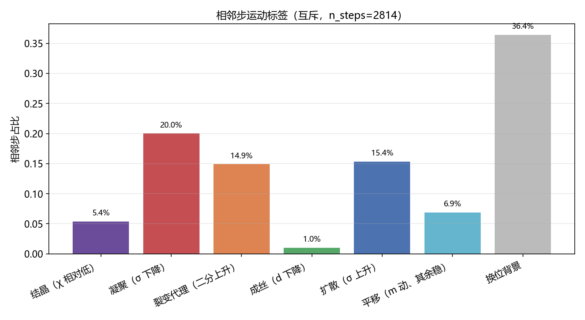
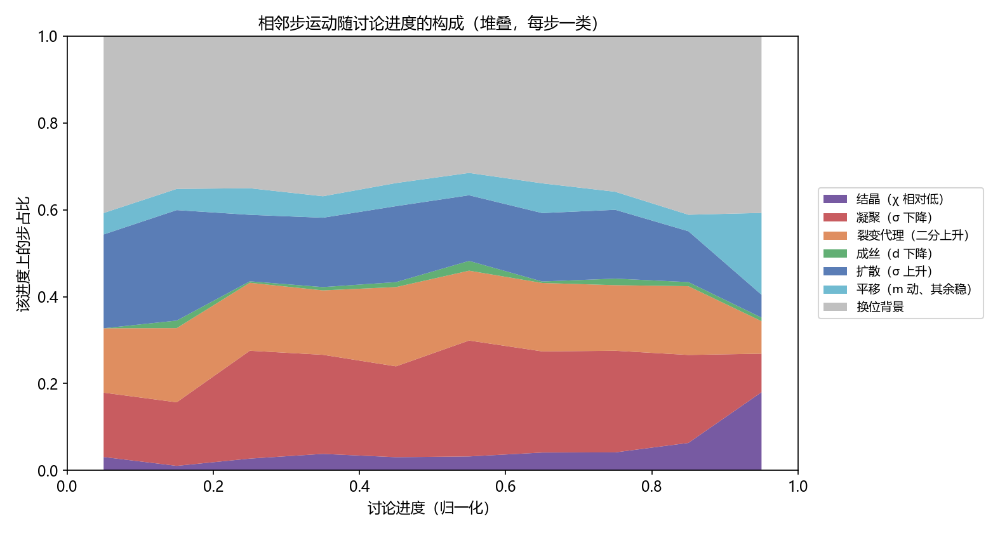
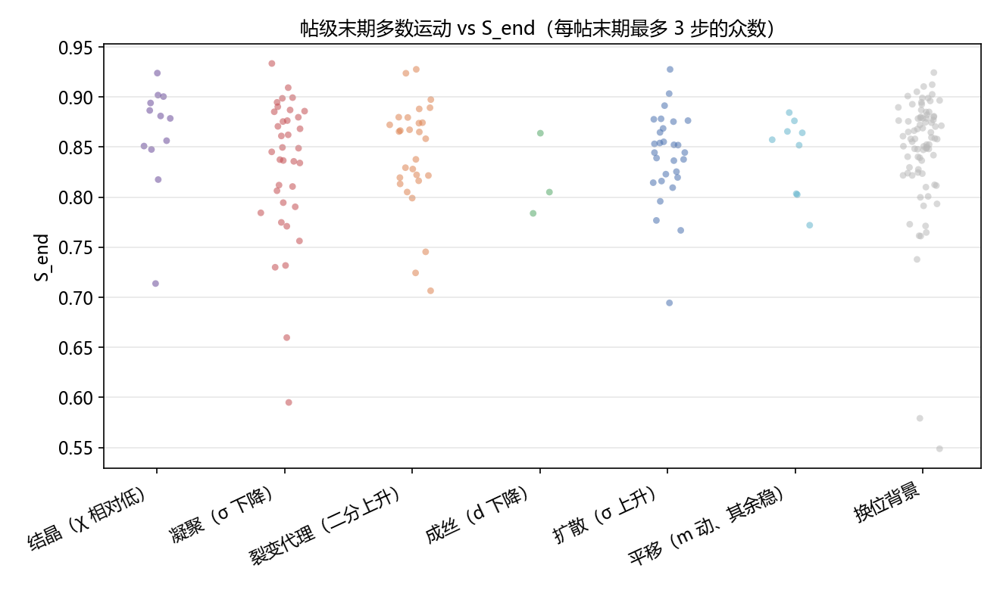

# 相邻步运动标签：pilot 200 第一版

**日期**：2026-08-26  
**样本**：评论级五个序参量，\(n=200\)，相邻步 \(n=2814\)  
**本文性质**：把老师运动表落到已有轨迹上的第一版互斥规则。不是十条运动的最终分类，也不是人机对比。  
**已锁定口径**：标签贴在 \(t-1\to t\)；身份无关 \(\chi\) 视为 Reddit 背景；Orbit / Vortex / Breathing / Cascade 在本尺度标为不可判定；每步互斥一类。

---

## 摘要

五个坐标描述云在某一时刻的状态；运动名称描述相邻两步之间哪些坐标变了。第一版只判别当前有信号的子集，优先级为：结晶 \(\to\) 凝聚 \(\to\) 裂变代理 \(\to\) 成丝 \(\to\) 扩散 \(\to\) 平移 \(\to\) 换位背景。阈值取 2814 步的样本内分位数，不是物理常数。结果显示：最大块是换位背景（36.4%）；纯平移少见（6.9%）；成丝几乎不出现（1.0%）；满足「\(\chi\) 相对低且几何冻住」的结晶为 5.4%，并在讨论最末段抬升。凝聚与扩散的占比接近所取的 20/80 分位，这一部分含有规则自身的成分，不能直接读成「人类讨论有 20% 的步在凝聚」。

---

## 1. 规则

对步 \(t\ge 1\) 定义 \(\Delta m=1-\cos(m_{t-1},m_t)\)，\(\Delta\sigma=\sigma_t-\sigma_{t-1}\)，\(\Delta d=d_t-d_{t-1}\)，\(\Delta b=b_t-b_{t-1}\)（\(b\) 为二分强度），\(\chi_t\) 为去中心匹配代价。

| 标签 | 命中条件 | 本样本阈值 |
|---|---|---|
| 结晶 | \(\chi\) 低于第 20 百分位，且 \(\lvert\Delta\sigma\rvert,\lvert\Delta d\rvert,\lvert\Delta b\rvert\) 不超过各自中位 | \(\chi\le 0.796\) 且几何稳定 |
| 凝聚 | \(\Delta\sigma\) 低于第 20 百分位 | \(\Delta\sigma\le -0.009\) |
| 裂变代理 | \(\Delta b\) 高于第 80 百分位 | \(\Delta b\ge 0.021\) |
| 成丝 | \(\Delta d\) 低于第 20 百分位 | \(\Delta d\le -0.177\) |
| 扩散 | \(\Delta\sigma\) 高于第 80 百分位 | \(\Delta\sigma\ge 0.009\) |
| 平移 | \(\Delta m\) 高于第 75 百分位，且 \(\sigma,d,b\) 稳定；**不要求** \(\chi\) 稳定 | \(\Delta m\ge 0.139\) |
| 换位背景 | 以上皆未命中 | — |

结晶若只写「\(\chi\) 低于第 20 百分位」，占比将机械地接近 20%。加上几何稳定后，它表示「换位相对低、形状也没在变」，更接近表中 Crystallization，而不是 \(\chi\to 0\)。本样本该阈仍约 0.80，只是相对低，不是绝对冻结。

---

## 2. 读数

| 标签 | 步占比 | 帖级末期众数占比 |
|---|---|---|
| 换位背景 | 36.4% | 41.5% |
| 凝聚 | 20.0% | 18.0% |
| 扩散 | 15.4% | 14.5% |
| 裂变代理 | 14.9% | 14.0% |
| 平移 | 6.9% | 4.5% |
| 结晶 | 5.4% | 6.0% |
| 成丝 | 1.0% | 1.5% |

图 2 上，换位背景全程约占四成；结晶在最末段抬升。这与「后期有一部分步进入相对低换位且几何稳定」相容，但不能写成「讨论在结晶中结束」：末期众数仍以换位背景为主（41.5%）。

图 3 上，各末期标签的 \(S_{end}\) 大量重叠。相邻步运动不是 \(S_{end}\) 的改写。

---

## 3. 能下与不能下的判断

能下：

1. 在身份无关 \(\chi\) 当背景的口径下，人类相邻步的主形态是「没有单一坐标越阈的换位」，不是干净的 Translation。
2. 中心单独搬走、其余稳定，只占约 7%。「搬走」很少以纯平移发生。
3. 成丝在本支撑上基本测不到。
4. \(S_{end}\) 不能代替步级运动标签。

不能下：

1. 不能把凝聚 20%、扩散 15% 读成过程的物理频率；它们接近分位规则的尾部大小。
2. 不能把结晶 5.4% 等同于老师表中 \(\chi\to 0\) 的 Crystallization。
3. 不能对 Orbit / Vortex / Breathing / Cascade 下存在性结论。
4. 不能把末期众数当作整帖的唯一运动。

---

## 4. 文件

| 路径 | 内容 |
|---|---|
| `outputs/labels/step_motions_pilot200.jsonl` | 2814 步的特征与标签 |
| `outputs/labels/thread_late_motions_pilot200.jsonl` | 帖级末期众数 |
| `outputs/metrics/step_motions_pilot200_stats.json` | 阈值与占比 |
| `scripts/classify_step_motions.py` | 本规则的实现 |
